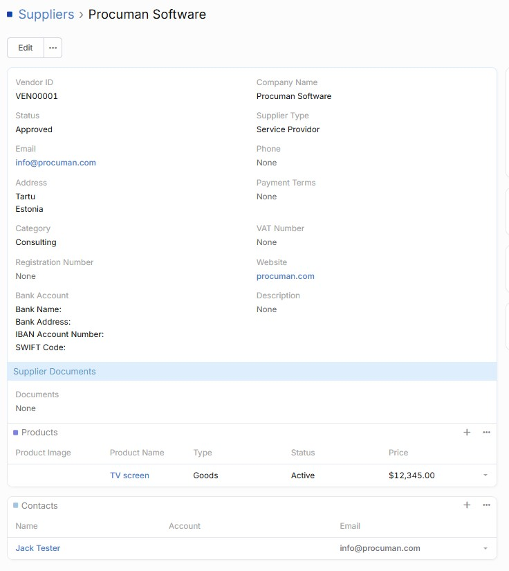
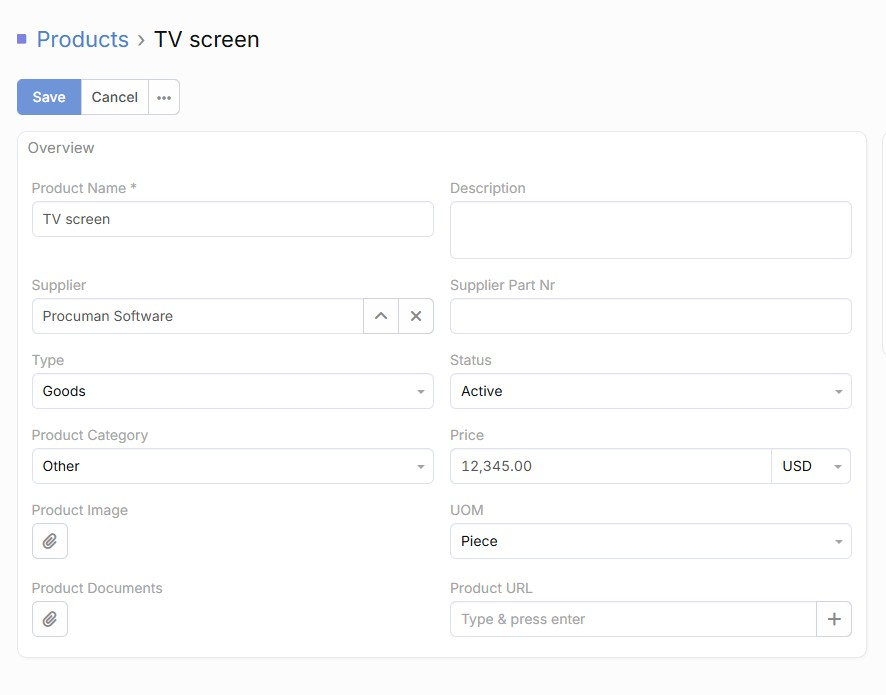
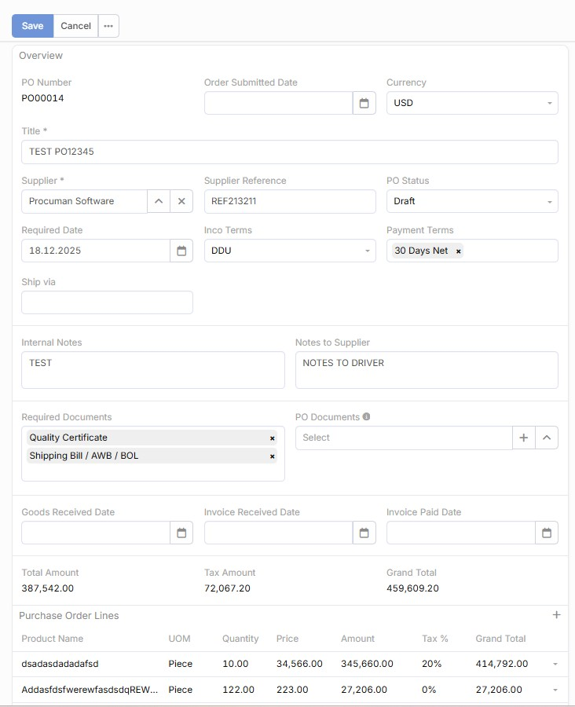

<div align="center">

# 

# **Procuman Community Edition**

[](LICENSE)
[](https://github.com/espocrm/espocrm)
[](procuman-ce-1.0.0.zip)

## 🚀 Free e-Procurement Software for Modern Business

**Community Edition of Procuman Software** - A powerful, free e-Procurement solution built on EspoCRM platform for managing suppliers, products, and purchase orders efficiently.

---

</div>

## ✨ Key Features

### 🏢 **Supplier Management**
- Comprehensive supplier database with contact information
- Supplier categorization
- Track supplier relationships

### 📦 **Product Catalog**
- Complete product and service management
- Supplier product associations
- Pricing tracking capabilities

### 📋 **Purchase Order Management**
- Streamlined PO creation
- Automated calculations for totals and taxes
- Professional PDF generation with customizable templates

### 🌍 **Multi-Language Support**
- Full localization support for global deployment

---

## 🖼️ **Screenshots**

### Supplier Management
<div align="center">
  
</div>

### Product Catalog
<div align="center">
  
</div>

### Purchase Order Creation
<div align="center">
  
</div>

---

## 🛠️ **Installation Guide**

### **Prerequisites**
- EspoCRM platform installed and running
- Admin access to EspoCRM administration panel
- PHP 8.2+ and MySQL/MariaDB database

### **Step 1: Install EspoCRM Platform**
```bash
# Clone and install EspoCRM
git clone https://github.com/espocrm/espocrm.git
cd espocrm
# Follow EspoCRM installation documentation
```

### **Step 2: Install Procuman CE Extension**
1. Download the latest `procuman-ce-1.0.0.zip` file
2. Login to your EspoCRM administration panel
3. Navigate to **Extensions** section
4. Click **Install Extension** and upload the zip file
5. Follow the installation wizard

### **Step 3: Configure PDF Template**
1. Navigate to **Administration** → **PDF Templates**
2. Create a new PDF template for Purchase Order entity
3. Copy and paste the HTML content from `Purchase_Order_PDF_Template_HTML.txt`
4. Customize the template with your company information:
   - Company logo and details
   - Address and contact information

### **Step 4: Configure User Permissions**
1. Go to **Administration** → **Roles**
2. Assign appropriate permissions for:
   - Supplier management access
   - Product catalog access
   - Purchase Order creation

---

## 🎯 **System Requirements**

| Component | Minimum | Recommended |
|-----------|---------|-------------|
| **PHP Version** | 8.2
| **Memory** | 512MB | 1GB+ |
| **Database** | MySQL 5.7 | MariaDB 10.3+ |
| **Web Server** | Apache 2.4 | Nginx 1.18+ |

---

## 🔧 **Configuration & Customization**

### **Custom Fields**
- Add custom fields to entities through Entity Manager
- Configure field types, validation rules, and relationships
- Create custom layouts for different user roles

### **Workflow Automation with EspoCRM Advance Pack extension**
- Set up automated approval processes
- Configure email notifications
- Create custom workflows for PO lifecycle

### **Integration Capabilities**
- REST API for third-party integrations
- Webhook support for real-time updates
- CSV import/export for data migration

---

## 🆘 **Support & Professional Services**

### **Need Help with Installation or Hosting?**
Our team of experts is here to help you with:
- ✅ Professional installation and setup
- ✅ Cloud hosting and maintenance
- ✅ Data migration from existing systems
- ✅ Custom development and integrations

### **Upgrade to Professional Edition**
Looking for advanced features? Check out our **Professional Edition** at **[procuman.com](https://procuman.com)** for:

#### 🚀 **Advanced Features**
- **Requisitions Management** - Multi-level approval workflows
- **Supplier Portal** - Self-service supplier access
- **Contract Management** - Automated contract lifecycle
- **e-Tendering** - Online bidding and auction system
- **Supplier Invoices** - Automated invoice processing
- **Inventory Management** - Real-time stock tracking

#### 💼 **Enterprise Benefits**
- Priority support with SLA guarantees
- Advanced security and compliance features
- Custom development and consulting
- Training and documentation

---

## 🤝 **Community & Contributing**

### **Get Involved**
- 🌟 **Star this repository** to show your support
- 🐛 **Report issues** and feature requests
- 💡 **Contribute code** and documentation
- 📢 **Share feedback** and success stories

### **Development**
This project is actively maintained by the Procuman team and community contributors. All development follows best practices for:
- Code quality and testing
- Security and performance
- Documentation and user experience

---

## 📄 **License**

Procuman Community Edition is licensed under the **MIT License** - see the [LICENSE](LICENSE) file for details.

---

## 📞 **Contact Us**

<div align="center">

**[🌐 Visit procuman.com](https://procuman.com)**

*Transform your procurement process with modern, efficient solutions*

---

**Made with ❤️ by the Procuman Team**

</div>
